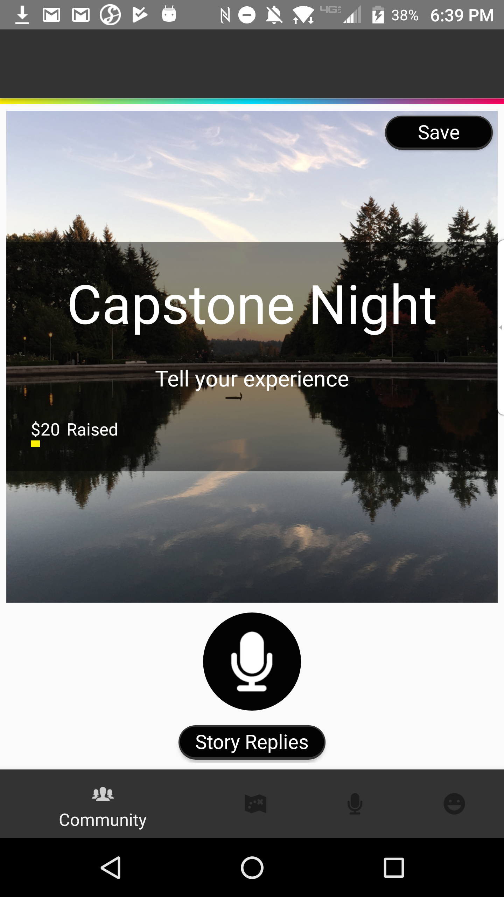
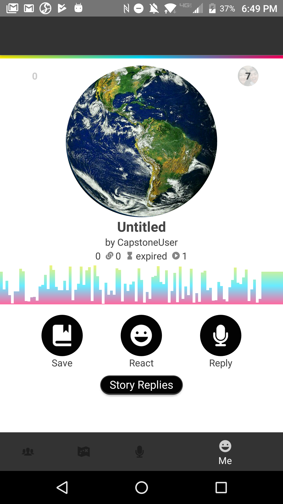
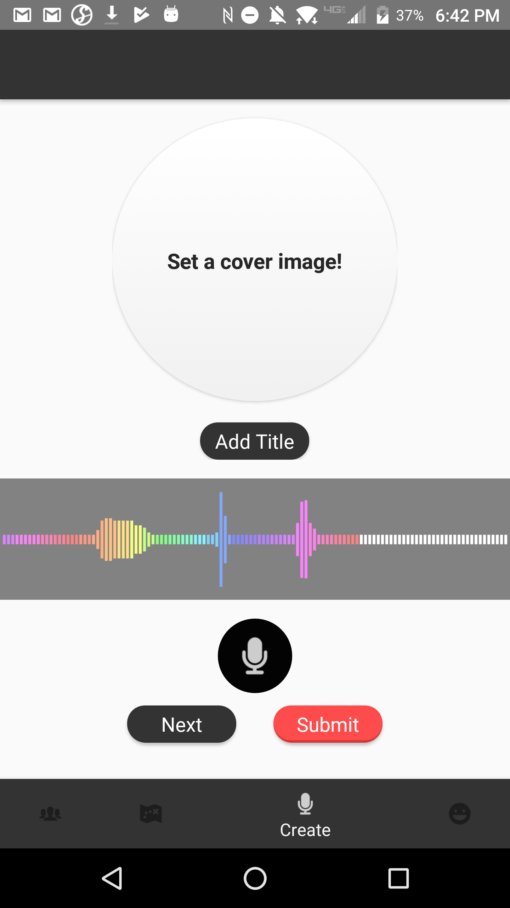
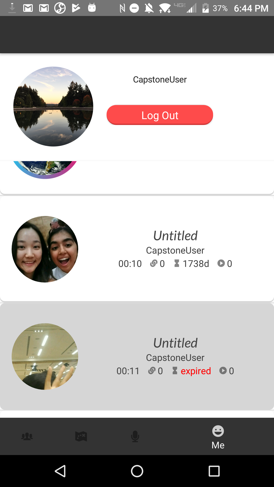
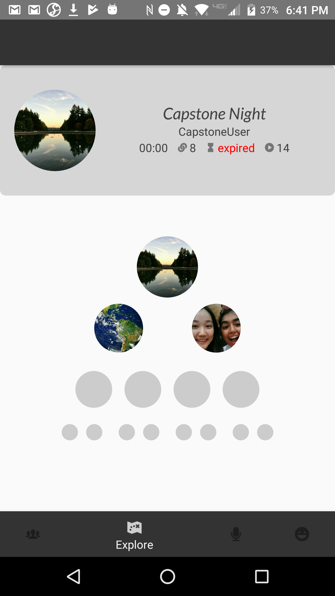

# TellToo
TellToo is an Android application for listening to and sharing voice recordings.
## Table of Contents
- [Table of Contents](#table-of-contents)
- [Overview](#overview)
- [Demo](#demo)
- [Screens](#screens)
  * [Community](#community)
  * [View](#view)
  * [Create](#create)
  * [Profile](#profile)
  * [Explore](#explore)
- [Key Features](#key-features)
- [Technologies](#technologies)
- [Limitations](#limitations)
- [Installation](#installation)
- [Credits & contact information](#credits)
- [License](#license)
- [Links](#links)
## Overview
TellToo focuses on the journey we take as individuals to find meaning, purpose, and fulfillment in life. For many of us, technology has changed the way we socialize. Platforms like Facebook, Twitter, and YouTube have pushed social interactions to shorter, less personal, and more trivial exchanges. This has left certain core elements of socialization in the dust. Our project focuses on modernizing those elements and building a platform that delivers a more human centric method of sharing and connecting. Our mobile application allows users to tell stories through audio recording and visually navigate chains to naturally related stories.
## Demo
See the docs/demo_media for demo videos and screens.
## Screens
### Community

### View

### Create

### Profile

### Explore

## Key Features
  1. Record stories
  2. Set story metadata including cover image, title, privacy and availability settings
  3. View story threads in a tree-based visualization
  4. Navigate stories using touch and swipe gestures
  5. Reply to stories by other users
  6. React to stories using emoticons
  7. Save stories to a personal collection
  8. Stories expire based on a time frame set by the user

## Technologies
Android API 16
Firebase Database + Auth + Storage

We chose to target Android because of its extensive documentation, extensive array of third-party libraries, our prior experience with Java, and access to Android hardware. These factors enabled us to create our app despite few resources and minimal experience in Android development.

We chose a minimum API level of 16, which provided a good compromise between the proportion of Android devices our app works on, and the features available to us during development.

We use Firebase for managing user authentication, data storage, and data synchronization. We chose Firebase because it was free, readily available, and easy to use and configure. More specifically, its document-based nature allowed us to change our schema frequently and easily as we discovered new requirements during development. In addition, Firebase can potentially store millions of records, which is suitable for scaling our app up with a paid plan in the future.

## Limitations
  1. There are discrepancies between our design prototype and the current state of its implementation.
  2. User data is not available across devices.
    a. The current demo stores data locally, in device storage. It was built for demonstration on UW iSchool Capstone Night with the expectation that WiFi and cellular service would be unavailable. The most recent build using Firebase is at https://github.com/eduardrg/Bauble/tree/profile-2.
  3. Story privacy settings are collected, but permissions are not yet implemented.
  4. All stories are public to all users.
  5. Tags are collected, but tag search & display are not yet implemented.
  6. Story visualization only displays the first two replies of any given node.

## Installation
TellToo is currently unreleased. If you would like to install it for testing or development:
  1. Install Android Studio
  2. Clone https://github.com/eduardrg/Bauble/ 
  3. Import your cloned repo as a project in Android Studio
  4. Build and run the project on a physical Android device. Running the app on an emulator is possible but uninteresting, because as of this writing, the Android Studio emulator does not support recording from a virtualized microphone.

## Credits
### Project Manager, Developer 
Chris Li • chris@telltoo.us •   
### Lead Developer
Eduard Grigoryan • eduard@telltoo.us •    
### UX & UI Designer
Sanchya Mahajan • sm96@telltoo.us •    
### Lead UX & UI Designer
Joel Elizaga • joel@telltoo.us •    

## License
Licensed under the Apache License, Version 2.0 (the "License"); you may not use this file except in compliance with the License.
You may obtain a copy of the License at
http://www.apache.org/licenses/LICENSE-2.0

Unless required by applicable law or agreed to in writing, software distributed under the License is distributed on an "AS IS" BASIS, WITHOUT WARRANTIES OR CONDITIONS OF ANY KIND, either express or implied. See the License for the specific language governing permissions and
limitations under the License.

## Links
GitHub: https://github.com/eduardrg/bauble  
Website: https://telltoo.us  
Design prototype: https://invis.io/FUBBG4FJ7  
